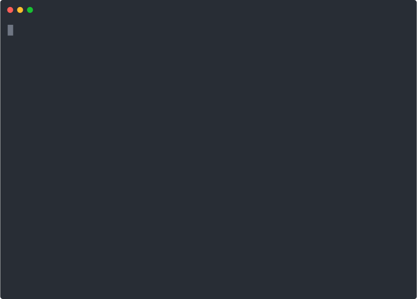

# Create Node App  

Create modern Node.js apps with no build configuration. In a single command, this tool bootstraps a React + Express app and a Postgres Docker container. Created apps closely follow [The Twelve Factors](https://12factor.net) of web application development. Inspired by and based on [create-react-app](https://github.com/facebook/create-react-app).

## Quick start

#### Creating an App

    npx create-node-app my-app
    cd my-app
    npm start

_Creates a new repository and starts a React frontend, an Express backend, and a container for Postgres locally_

#### Deploying to Production

    npm run deploy

_Containerizes your app and its dependencies (like Postgres) and deploys them to Kubernetes_

## What’s Included?

`create-node-app` automatically sets up and manages:

- A complete web app with React, Express, Postgres
- A deploy script, `npm run deploy` that deploys your frontend, backend, and dependencies to Kubernetes via [deploy-node-app](https://github.com/kubesail/deploy-node-app)
- A DB script `npm run psql` to explore your Dockerized Postgres
- Creates a secure `Dockerfile` for containerized production deploys
- Developer tools: ESLint, editorconfig, prettier, automatic reload
- A [meta-module](https://github.com/metamodules/documentation) system for easy development with services like PostgreSQL, and MongoDB, all with no configuration

`create-node-app` has a simple core, with a small ecosystem of _meta-modules_.

## Meta-modules

Meta-modules are simple npm modules which include:

- A validated and secure Node.js library
- Metadata for configuring the library (Environment Variables)
- A Docker Container Image which is validated to work with the chosen library
- Metadata for configuring the service's container

For example, the [postgres meta-module](https://github.com/metamodules/postgres) bundles the [node-postgres](https://github.com/brianc/node-postgres) library, a Postgres 11 Docker image, and knows how to connect your app to Postgres, _without any configuration!_ Meta-modules wrap some of the complexity of building microservices with Node.js, allowing you to rapidly iterate with the stack of your choice!

Explore modules [here](https://github.com/metamodules) or help create them if the one you want doesn't exist!

## Free App Hosting

This project is maintained by [KubeSail](https://kubesail.com), which provides free-tier hosting. After creating an app, try `npm run deploy` to easily launch your app on a Kubernetes cluster with built-in load-balancing, HTTPS, and high-availability! KubeSail also offers the best way to iterate on Kubernetes resources - check us out!

## Contributing

- If you feel that this tool can be improved, or you've created a meta-module you want us to include, feel free to open an issue or pull request!
- We also value contributions on [deploy-node-app](https://github.com/kubesail/deploy-node-app) which contains the bulk of the logic for creating and deploying dev and prod environments.
